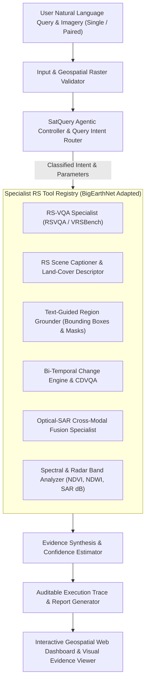

# SatQuery AI - Multimodal Remote Sensing Vision-Language Assistant

**Organization:** Indian Space Research Organisation (ISRO) / Space Applications Centre (SAC)  
**Category:** Software | **Theme:** Space Technology  
**Mission Scope:** Interactive Vision-Language Assistant for Multimodal Remote Sensing Image Analysis through Natural Language Text Queries.

---

## 🛰️ Overview & System Architecture

**SatQuery AI** is an agentic, query-driven remote-sensing AI framework designed to overcome the limitations of monolithic VLMs on complex Earth observation data. Rather than applying a single generic model, SatQuery AI dynamically inspects query semantics, validates geospatial raster metadata (GeoTIFF/TIFF CRS, spatial resolution, optical/multispectral bands, SAR polarizations), and orchestrates specialist remote-sensing models from a predefined registry.



---

## ✨ Key Capabilities & Functional Scope

### 1. Mandatory Single-Image Baseline
- **RS-VQA Specialist**: Evaluated on RSVQA and VRSBench style benchmarks. Answers existence, counting, spatial quadrant, and land-use dominance questions.
- **Scene Captioner & Land-Cover Descriptor**: Produces multi-scale structured remote-sensing summaries, quantifying dominant BigEarthNet land-cover distributions.
- **Text-Guided Region Grounding**: Grounds arbitrary geographical entities referenced in queries (e.g. *"Highlight the water body"*, *"Identify airport runways"*), returning precise bounding boxes, binary segmentation masks, and pixel overlays.

### 2. Multi-Image Bi-Temporal Change Analysis
- **Change Vector Analysis (CVA)**: Evaluates spectral and radiometric difference magnitudes between pre-event (T1) and post-event (T2) observations.
- **Continuous Spatial Change Heatmaps & Binary Change Masks**: Visualizes exact zones of structural alteration, urban sprawl, deforestation, and flood inundation.
- **Change-VQA (CDVQA)**: Accurately answers change dynamic queries (e.g. *"Has the built-up area increased, decreased, or remained unchanged?"*, *"What changed between these two dates, and where did the change occur?"*).

### 3. Cross-Modal Optical + SAR Complementary Fusion
- Joint reasoning over co-registered **Optical/Multispectral** (Cartosat-2S style) and **Synthetic Aperture Radar / SAR** (RISAT-1A style) pairs.
- Fuses optical spectral reflectance (color, NDVI, NDWI) with SAR microwave backscatter geometry (surface roughness, moisture, double-bounce built-up return, specular water absorption).
- Generates thematic multimodal land-cover classification maps and fused false-color composites.

### 4. Agentic Orchestration & Auditable Execution Traces
- **Transparent Execution Summaries**: Every query produces an auditable trace containing the classified task, selected models, permitted parameters, latency (ms), and calibrated confidence scores.
- **Downloadable Reports**: One-click export to PDF and structured JSON reports adhering to ISRO/SAC evaluation standards.

---

## 📂 Repository Structure

```
Satquery/
├── backend/
│   ├── app.py                      # FastAPI server & static file host
│   ├── config.py                   # System configuration & BigEarthNet classes
│   ├── core/
│   │   ├── agent.py                # SatQuery Agentic Controller & Intent Classifier
│   │   ├── tool_registry.py        # Specialist RS Model Registry & Dispatcher
│   │   ├── validator.py            # Image format, GeoTIFF, and pair validator
│   │   ├── evidence.py             # Evidence synthesis & confidence estimation
│   │   └── trace.py                # Auditable execution trace recorder
│   ├── models/
│   │   ├── rs_domain_adapter.py    # BigEarthNet adapted representation backbone
│   │   ├── rs_vqa_engine.py        # RSVQA / VRSBench remote sensing VQA specialist
│   │   ├── rs_captioner.py         # RS scene description & land-cover summarizer
│   │   ├── rs_grounding.py         # Text-guided region grounding & bounding box locator
│   │   ├── rs_change_engine.py     # Bi-temporal change detector & CDVQA specialist
│   │   └── rs_optical_sar_fusion.py # Optical-SAR cross-modal fusion specialist
│   ├── utils/
│   │   ├── geotiff_io.py           # GeoTIFF metadata parser & spectral index calculator
│   │   ├── visualization.py        # Overlays & split slider composites
│   │   └── report_builder.py       # PDF (ReportLab) & JSON report generator
│   └── sample_data/                # Benchmark GeoTIFF & image pairs
│       ├── single_optical/         # Cartosat-2S optical scene
│       ├── single_sar/             # RISAT-1A SAR backscatter scene
│       ├── bitemporal_pairs/       # 2021 T1 vs 2024 T2 urban change pair
│       └── optical_sar_pairs/      # Co-registered Cartosat + RISAT pair
├── frontend/
│   ├── src/
│   │   ├── App.jsx                 # Main application dashboard
│   │   ├── components/
│   │   │   ├── Header.jsx          # ISRO/SAC mission badge & status
│   │   │   ├── InputPanel.jsx      # Modality switcher & sample catalog
│   │   │   ├── ImageViewer.jsx     # Split slider & layer toggle viewer
│   │   │   ├── ChatInterface.jsx   # Conversational natural-language query UI
│   │   │   ├── EvidenceViewer.jsx  # Grounded metrics & land-cover graphs
│   │   │   ├── ExecutionTrace.jsx  # Auditable tool execution trace table
│   │   │   ├── ReportModal.jsx     # Downloadable PDF/JSON report modal
│   │   │   └── ToolsModal.jsx      # Registered specialist models catalog
│   │   └── services/api.js         # API client
│   ├── package.json
│   ├── vite.config.js
│   └── tailwind.config.js
├── tests/
│   ├── test_agent.py               # Agentic routing & representative query tests
│   ├── test_single_vqa.py          # Single VQA, captioning, and grounding tests
│   ├── test_bitemporal_change.py   # Bi-temporal change & optical-SAR tests
│   └── test_geotiff_io.py          # GeoTIFF I/O & spectral index tests
├── requirements.txt
└── README.md
```

---

## 🚀 Quick Start Guide

### 1. Install Backend Dependencies
```bash
pip install -r requirements.txt
```

### 2. Generate Benchmark Sample Datasets
```bash
python -m backend.sample_data.generator
```

### 3. Run Automated Test Suite
```bash
python -m pytest tests/ -v
```

### 4. Launch SatQuery AI Web Application
```bash
# Start FastAPI backend (which also serves the compiled React web app)
python -m backend.app
```
Access the interactive dashboard at **`http://127.0.0.1:8000`** in your browser.

*For active frontend development with live hot-reload:*
```bash
cd frontend
npm run dev
```

---

## 🎯 Representative Query Test Matrix

| # | Representative Query | Modality / Input | Dispatched Specialist Tools | Generated Visual & Textual Evidence |
|---|---|---|---|---|
| **1** | *"Describe the land-cover and major objects visible in this image."* | Single Optical (Cartosat-2S GeoTIFF) | `RSCaptioner`, `RSDomainAdapter` | Multi-scale scene summary, BigEarthNet class distribution percentages. |
| **2** | *"Highlight the water body referred to in the query."* | Single Optical (Cartosat-2S GeoTIFF) | `RSGroundingEngine` | Bounding boxes, cyan segmentation overlay, area coverage %. |
| **3** | *"What changed between these two dates, and where did the change occur?"* | Bi-Temporal Pair (2021 T1 vs 2024 T2) | `RSChangeEngine` | Continuous change heatmap, binary change mask, quantified % delta. |
| **4** | *"Has the built-up area increased, decreased, or remained unchanged?"* | Bi-Temporal Pair (2021 T1 vs 2024 T2) | `RSChangeEngine` (CDVQA) | Trend classification (*increased*), structural delta analysis. |
| **5** | *"Use the optical and SAR images together to identify built-up and water-covered regions."* | Cross-Modal Pair (Cartosat + RISAT) | `RSOpticalSARFusionEngine` | Fused composite, joint thematic land-cover classification map. |

---

## 📄 License & Standards
Developed under the **ISRO / SAC Space Technology** evaluation framework for Multimodal Remote Sensing Vision-Language Assistants.
